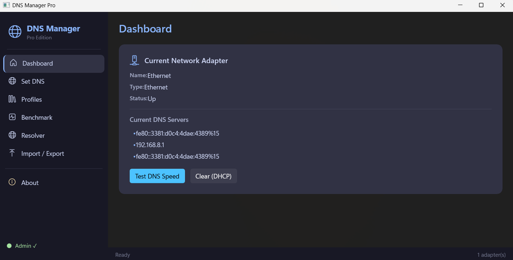

<<<<<<< HEAD
# 🌐 DNS Manager Pro

A modern, feature-rich DNS management application for Windows built with **WinUI 3** and **.NET 8**. Change DNS servers, manage profiles, benchmark DNS speed, and resolve domains — all from a sleek dark-themed interface.


---

## ✨ Features

### 🔧 DNS Configuration
- **Set custom DNS** — Primary and secondary DNS for any network adapter
- **Quick Select** — One-click preset DNS servers (Cloudflare, Google, OpenDNS, Quad9, AdGuard, CleanBrowsing)
- **Clear DNS (DHCP)** — Reset adapter to automatic DNS with a single click

### 💾 Profile Management
- **Save profiles** — Store frequently used DNS configurations
- **Apply profiles** — Switch between saved DNS profiles instantly
- **Rename & Delete** — Full profile management via Windows Registry
- **Persistent storage** — Profiles saved in `HKCU\Software\DnsManager\Profiles`

### 📊 DNS Benchmark
- **Speed comparison** — Compare latency of 6 popular DNS servers side-by-side
- **Color-coded results** — Green (<20ms), Yellow (<50ms), Red (>50ms) for instant readability
- **Real-time progress** — Results update as each server is tested

### 🔍 DNS Resolver
- **Domain resolution** — Resolve any domain to its IP addresses
- **Custom DNS server** — Query a specific DNS server for resolution
- **Latency measurement** — Test DNS server response time

### 📤 Import / Export
- **Export to JSON** — Export all profiles or a specific profile by ID
- **Import from JSON** — Import profiles with merge or replace mode
- **Portable format** — JSON files can be shared across machines

### 🛡️ Admin Elevation
- **Auto UAC prompt** — Automatically requests admin privileges on startup
- **Manual restart** — "Restart as Admin" button in sidebar
- **Admin indicator** — Visual status showing current privilege level

### 🎨 User Interface
- **Catppuccin Mocha theme** — Beautiful dark color palette
- **Mica backdrop** — Native Windows 11 transparency effect
- **Sidebar navigation** — Clean, organized page-based layout
- **Status bar** — Real-time operation feedback with loading indicator

---

## 📸 Screenshots

> _Add your screenshots to the `Screenshots/` folder and update the paths below._

| 


---

## 🚀 Getting Started

### Prerequisites

- **OS**: Windows 10 version 19041 (21H1) or later
- **SDK**: [.NET 8 SDK](https://dotnet.microsoft.com/download/dotnet/8.0)
- **Workload**: Windows App SDK development
  ```bash
  dotnet workload install winui
  ```
- **Visual Studio 2022** (optional, for IDE development)
  - Workload: `.NET Desktop Development`
  - Component: `Windows App SDK C# Templates`

### Build from Source

```bash
# Clone the repository
git clone https://github.com/RoOt-zErO/DNSManagerGUI.git
cd DNSManagerGUI

# Restore NuGet packages
dotnet restore

# Build
dotnet build -c Release

# Run (unpackaged)
dotnet run
```

### Publish as Single File

```bash
dotnet publish DNSManagerGUI.csproj \
  -c Release \
  -r win-x64 \
  --self-contained true \
  -p:PublishSingleFile=true \
  -o ./publish
```

The output executable will be at `./publish/DNSManagerGUI.exe`.

> **Note:** Publish trimming is not compatible with WinUI 3 / WinRT interop and is disabled by default.

---

## 🏗️ Project Structure

```
DNSManagerGUI/
├── App.xaml / App.xaml.cs          # Application entry, auto UAC elevation
├── MainWindow.xaml / .cs           # Main window with sidebar navigation
├── InputDialog.cs                  # Reusable input ContentDialog
├── app.manifest                    # DPI awareness & OS compatibility
├── Package.appxmanifest            # App package manifest
│
├── Models/
│   └── DnsProfile.cs               # Data models (DnsProfile, BenchmarkResult)
│
├── Services/
│   ├── AdminHelper.cs              # Admin elevation & UAC relaunch
│   ├── DnsConfigurator.cs          # Set/clear DNS via WMI
│   ├── DnsResolver.cs              # DNS resolution & latency (DnsClient)
│   ├── NetworkAdapterFinder.cs     # Find & filter network adapters
│   ├── ProfileExporter.cs          # JSON import/export
│   └── RegistryStore.cs            # Registry-based profile CRUD
│
├── Properties/
│   ├── launchSettings.json         # Debug profile (Unpackaged)
│   └── PublishProfiles/            # Publish configurations
│
└── Assets/                         # App icons & logos
```

---

## 🛠️ Technology Stack

| Component | Technology |
|-----------|-----------|
| UI Framework | [WinUI 3](https://learn.microsoft.com/windows/apps/winui/winui3/) (Windows App SDK 2.1) |
| Runtime | [.NET 8](https://dotnet.microsoft.com/download/dotnet/8.0) |
| Language | C# 12 |
| DNS Operations | [DnsClient](https://github.com/MichaCo/DnsClient.NET) |
| DNS Configuration | WMI (`System.Management`) |
| Profile Storage | Windows Registry (`Microsoft.Win32.Registry`) |
| Serialization | `System.Text.Json` |
| Theme | [Catppuccin Mocha](https://catppuccin.com/) |

---

## 📋 Quick Select DNS Servers

| Provider | Primary | Secondary |
|----------|---------|-----------|
| **Cloudflare** | 1.1.1.1 | 1.0.0.1 |
| **Google** | 8.8.8.8 | 8.8.4.4 |
| **OpenDNS** | 208.67.222.222 | 208.67.220.220 |
| **Quad9** | 9.9.9.9 | 149.112.112.112 |
| **AdGuard** | 94.140.14.14 | 94.140.15.15 |
| **CleanBrowsing** | 185.228.168.9 | 185.228.169.9 |

---

## ⚠️ Known Limitations

- **Windows only** — WinUI 3 is exclusive to Windows 10 19041+
- **Admin required** — DNS changes need administrator privileges (UAC prompt is automatic)
- **No IPv6-only support** — Quick Select presets use IPv4 addresses
- **No auto-refresh** — Dashboard must be refreshed manually after DNS changes
- **Unpackaged mode** — App runs unpackaged (no MSIX package deployment)

---

## 🤝 Contributing

Contributions are welcome! Here's how you can help:

1. **Fork** the repository
2. Create a **feature branch** (`git checkout -b feature/amazing-feature`)
3. **Commit** your changes (`git commit -m 'Add amazing feature'`)
4. **Push** to the branch (`git push origin feature/amazing-feature`)
5. Open a **Pull Request**

### Ideas for Contribution

- IPv6 DNS server support
- DNS-over-HTTPS (DoH) configuration
- Auto-refresh dashboard on network changes
- System tray minimize
- Multi-language support
- Dark/light theme toggle

---

## 👨‍💻 Developer

<p align="center">
  
</p>

<div align="center">

**RoOt㉿zErO**

Security Researcher & Developer

🌐 [mrrezanemati.ir](https://mrrezanemati.ir) · 💬 [Telegram @webs7](https://t.me/webs7)

</div>

---

## 📄 License

This project is licensed under the **MIT License** — see the [LICENSE](LICENSE) file for details.

```
MIT License

Copyright (c) 2025 RoOt㉿zErO

Permission is hereby granted, free of charge, to any person obtaining a copy
of this software and associated documentation files (the "Software"), to deal
in the Software without restriction, including without limitation the rights
to use, copy, modify, merge, publish, distribute, sublicense, and/or sell
copies of the Software, and to permit persons to whom the Software is
furnished to do so, subject to the following conditions:

The above copyright notice and this permission notice shall be included in all
copies or substantial portions of the Software.

THE SOFTWARE IS PROVIDED "AS IS", WITHOUT WARRANTY OF ANY KIND, EXPRESS OR
IMPLIED, INCLUDING BUT NOT LIMITED TO THE WARRANTIES OF MERCHANTABILITY,
FITNESS FOR A PARTICULAR PURPOSE AND NONINFRINGEMENT. IN NO EVENT SHALL THE
AUTHORS OR COPYRIGHT HOLDERS BE LIABLE FOR ANY CLAIM, DAMAGES OR OTHER
LIABILITY, WHETHER IN AN ACTION OF CONTRACT, TORT OR OTHERWISE, ARISING FROM,
OUT OF OR IN CONNECTION WITH THE SOFTWARE OR THE USE OR OTHER DEALINGS IN THE
SOFTWARE.
```

---

<div align="center">

⭐ If you find this project useful, consider giving it a star!

**Built with ❤️ using WinUI 3 & .NET 8**

</div>
=======
# DNSManagerGUI
DNS Manager GUI
>>>>>>> 93349813c12cbc09753129ed1fe695bbdd29ead3
